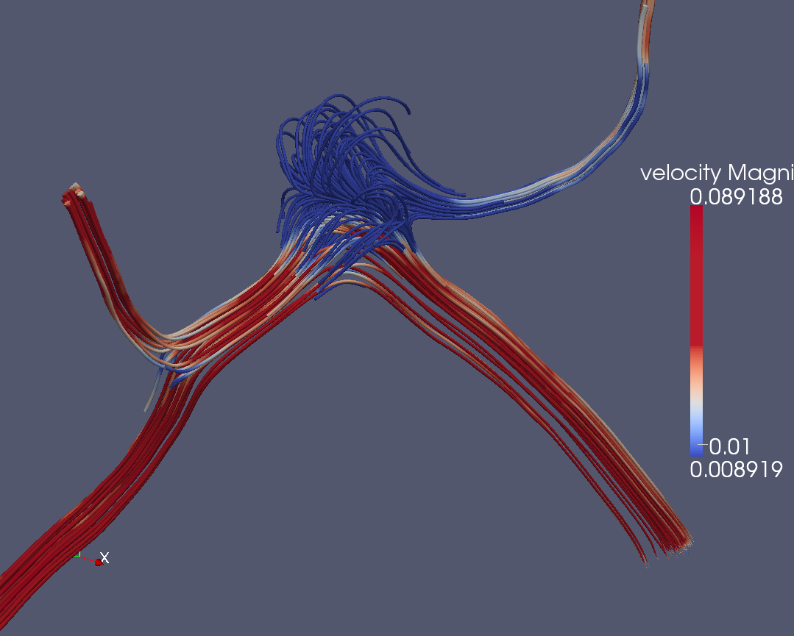

Experiences from UCL
====================

The UCL Research Software Group
-------------------------------

* Started 2012
* Helped UCL win over 1.5M in research income
* Grown through grant funding from just me to a team of 8
* Works with researchers from archaeology to astrophysics
* Part of [UCL RITS](https://www.ucl.ac.uk/research-it-services)

Readable, reliable, and reproducible
---------------------------------

We help make code:

* Last beyond the end of the grant that funded it
* Be usable by someone other than the PhD student who wrote it
* Have a standard of correctness better than "the graph looks about right"

Clean code makes performance possible
=====================================

Whodunnit code: low-template DNA
--------------------------------

Structural work on likeLTD
--------------------------------------------

* Broken down into functions
* Separate objective function from home-made optimiser
* Use standard optimiser libraries

Performance Improvements in likeLTD
-------------------------------------------

* 4 times from moving to C
* 8 times from parallelisation
* 10 times from change of optimisation algorithm
* 300 times total

Engineering helps legacy code live
==================================

Old State of the Code
-----------------

* Venerable Fortran
* Hasn't compiled since 2006
* Underpins Nature-published research

The response
---------

* Old code as a "test Oracle"
* Reimplemented in C++ and Python
* Use linear algebra and root finding libraries
* Not slower

Current work
------------

* ARCHER parallelisation
* MCMC inferential algorithm

Reliability unlocks science
===========================

HemeLB Setup Tool
-----------------

Robustness
----------

* Can handle all geometries instead of 19 in 20
* Means can model changing geometries
* Reliability unlocks new science

Good, huh?
==========

Lessons learned
---------------

Well, it hasn't always been pretty.

I'll try to indicate some tips and tricks learned while
creating a generalist science-as-a-service software group.

Some of these we got right. Some are things I wish I'd
known at the beginning.

Sell performance, deliver reproducibility
-----------------------------------------

](http://farm7.staticflickr.com/6144/6202830241_f16833fbaf_z.jpg)

Use appropriate technology
--------------------------

](http://africawindmill.org/wp-content/uploads/2013/03/DSC01549-Copy-2-.jpg)

Look beyond the usual
---------------------

 ](https://www.ucl.ac.uk/research-it-services/about/research-software-development/carousel/ORACC.jpg)

Recruit flexibly, and nurture
-----------------------------

Organisational Judo
-------------------

Computational Science as a Service
----------------------------------

<iframe width="420" height="315" src="https://www.youtube.com/embed/p85xwZ_OLX0" frameborder="0" allowfullscreen></iframe>

Copyright
---------

The sourcecode of this talk is available under a CC-BY license:

* [https://github.com/UCL/rsd-talks/tree/master](https://github.com/UCL/rsd-talks/tree/master)

The images in this talk are not copied. They are embedded or "transcluded".

* [Transclusion](https://en.wikipedia.org/wiki/Transclusion)
* [Transclusion and copyright](http://www.create.ac.uk/blog/2014/11/28/eu-ruling-embedding-does-not-equal-copyright-infringement/)
