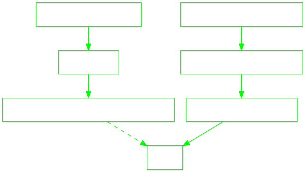
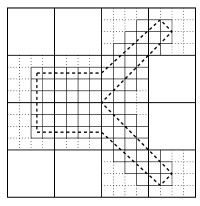
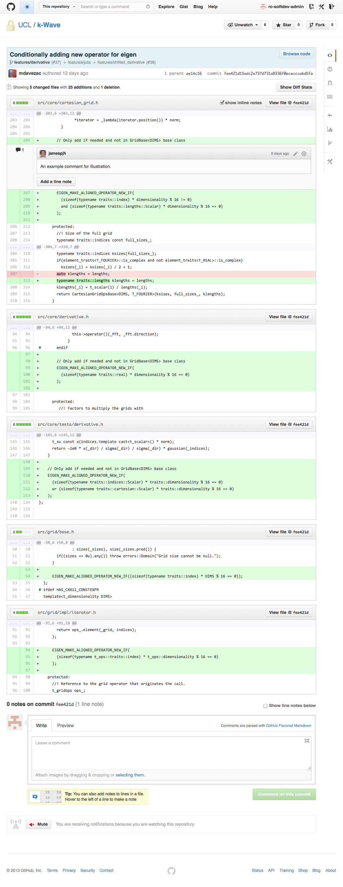
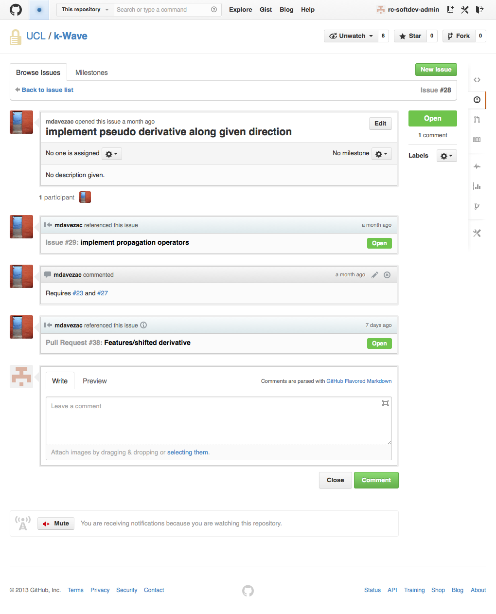
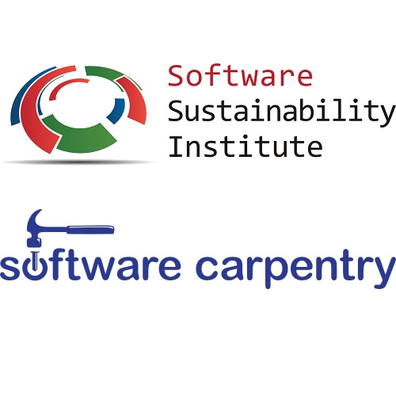

James Hetherington
------------------

* PhD, Theoretical Physics
    * High-Energy Physics, Cavendish Laboratory
* Post-doc, systems biology, UCL CoMPLEx
    * Glucose homeostasis
* The MathWorks
    * Senior Developer, Model Management Group
* Senior Scientific Innovator, AMEE UK Ltd
    * Environmental impact modeling
* Scientific Programmer, UCL CCS
    * Brain blood flow CFD
* Leader and Founder, UCL Research Software Development

The State of Research Software
================================

The SIRO Problem
----------------

~~Garbage in Garbage Out~~

Sensible In, Reasonable Out.

PhDWare
-------

* Don't look if anyone's done it before
* Code till it works
* Generate a figure
* Throw it away

Labware
-------

* Understood by one genius
* Implements great science, now
* FORTRAN in any language
* Code not engineered for readability
* Can't add new science

HPCWare
-------

* Get a 5% improvement in performance
* On a particular architecture
* Publish a scaling graph
* Selection against:
      * Readability
      * Maintainability
      * Adaptability

ConsultantWare
--------

* Little understanding of the science
* Overengineered
* Unmaintainable by the research group

Research Software Developers
============================

The Craftsperson And The Scholar
----------------------------
           


Research Software Developers
----------------------------


Research Software Developers
----------------------------

* Not researchers
    * No personal research agenda
* Facilitative, supportive, and collaborative
    * Deep engagement with research groups
    * Understand, study, and be part of group research activities
    * Can read and understand the papers
* Sustainable and long term
    * Institutional memory
    * Continuity, stability, maintainance

Why it works
------------

* People *want* to be RSEs
* We need a name, and some status
* There isn't a shortage of talent
* But the research system needs to
    * Promote and preserve its soft benefits better
    * Measure and incentivise correctly
    * Integrate RSEs within HEIs
    * Support institutional innovation

UCL Research Software Development
=================================

Governance
----------



The Board
-----

   

Activities
----------

* Projects
* Consulting
* Training
* Infrastructure

Domain
------

* From HPC codes to simple scripts
* From theoretical physics to digital humanities

UCL Staffing
------------

* 3 Permanent Roles
* Team Leader : James Hetherington
* Two Research Software Developers
* Additional research-grant funded roles
* Two so far

Call for projects
-----------------------------

* Judged by executive
* Every quarter
* Half FTE for term 
* Worth £8k
* Eight projects so far

Paid Projects
=============

Paid Projects
-------------

* Via research grants
* Or existing college money
* Displaces free calls
    * Until recruit
* Submitted £0.5M
* Secured £130k

Some sample projects
====================

Low-Template DNA
================

Whodunnit code: low-template DNA
--------------------------------

 

Whodunnit code: low-template DNA
-----------------------

* Low-template DNA
* Relative likelihood of defence and prosecution hypotheses
* Optimise over relative degree of contribution from various individuals

Structural work on likeLTD
--------------------------------------------

* Broken down into functions
* Separate objective function from simulated annealing optimiser
* Look at using different optimiser libraries
* Documentation added
* Ready for publication to CRAN

Performance Improvements in likeLTD
-------------------------------------------
  
* 4 times from moving to C
* 8 times from parallelisation
* 10 times from change of optimisation algorithm
* 300 times total

Performance Improvements in likeLTD
-----------------------------------


DCProgs
=======

DCProgs
-------


Old State of the Code
-----------------

* Hasn't compiled since 2006
* Underpins Nature-published research
* Reimplemented in C++ and Python
* Use linear algebra and root finding libraries

New State
---------

* Reimplemented in Modern C++ and Python
* Just as performant as the Fortran

HemeLB Setup Tool
=================

HemeLB Setup Tool
-----------------


Voxelisation
------------




Robustness
----------


Robustness
----------

* ~95% to 100%.
* Voxelisation in the loop

Priorities
==========

Priorities
----------

* Readability
* Reliability
* Deployability
* Sustainability
* Replicability
* Usability
* Performance

**In that Order**

Sources of Software Culture
===========================

Sources of Software Culture
---------------------------

* Enterprise software
* Web software
* Research Software

The Agile Manifesto
--------------------

We are uncovering better ways of developing
software by doing it and helping others do it.

Through this work we have come to value:

* Individuals and interactions over processes and tools
* Working software over comprehensive documentation
* Customer collaboration over contract negotiation
* Responding to change over following a plan

That is, while there is value in the items on
the right, we value the items on the left more.

Kent Beck et. al. 2001

Agile Processes
---------------

* Short work cycles
* Controlled meetings
* Iterative development
* Customers inside the team
* Collaboration not contract

Continuous Delivery
-------------------

* Release early
* Release often
* Use DevOps for automated deployment

Test Driven Development
-----------------------

* Test everything
* Test first
* Test all the time
* Use tests as specs

Infrastructure
--------------

* Version Control
* Issue Tracking
* Code Review
* Code sharing
* Continuous Integration

Code Management Infrastructure
==============================

Github
------


Issue Tracking
------------------------------


Code Differences
------------------------------


Comment on Code
------------------------------



Bug Discussion
------------------------------



Pull Requests
------------------------------


Social Coding
------------------------------


Testing
=======

You don't need to test if:
--------------------------

> * Your programs always work correctly, or
> * You don't care if they're correct or not, so long
    as their output looks plausible, and
> * You like being inefficient: 
    the more you invest in quality, the less total time
    it takes to build working software


Tests As Specifications
-----------------------

Testing tells you:

> * If the program is doing what it's supposed to
> * What the program actually is supposed to do
> * Tests are runnable specifications:
> * Less likely to fall out of sync with the program
    than documentation

Levels of Testing
-----------------

> * Regression testing: Does my code work the same as yesterday
> * Functional testing: Does my code match an analytic solution
> * Unit testing: Does this subroutine work as expected
  
Continuous Testing Infrastructure
---------------------------------


Jenkins
---------------------------------


Cross-platform Testing
---------------------------------


Automation
==========

How Things Should Be
--------------------

``` Bash
fetch_dataset 53b6
run_model dataset_53b6
Examine_results results_28_02_13_1_53b6_98d2
archive_results latest
create_graphs results_28_02_13_1_53b6_98d2
```

Program or Be Programmed
------------------------

* Repetition Leads to Boredom
* Boredom Leads To Horrifying Mistakes
* Horrifying Mistakes to God-I-Wish-I-Was-Still-Bored

Automated Deployment
--------------------

 Puppet/Chef

 Rake/Scons/CMake

 Fabric/Capistrano

[This talk!](http://github.com/UCL/rsd-talks)

This talk's SConscript
----------------------

``` python
pandoc_slides=Builder(action='pandoc -t revealjs -s -V theme=night'+
    ' --css=night.css'+
    ' --css=slidetheme.css'+
    ' --mathjax '+
    ' -V revealjs-url=http://lab.hakim.se/reveal-js/'+
    ' $SOURCES -o $TARGET')

...    
dot_figure_builder=Builder(action='dot -Tpng $SOURCE -o $TARGET',
    suffix='.png',
    src_suffix='.dot')
    
shell_figure_builder=Builder(action='bash $SOURCE $TARGET',
    suffix='.png',
    src_suffix='.sh') 
    
carousel_builder=Builder(action=carousel.carousel_action, 
    suffix=".png",src_suffix=".carousel")   
                             
def wget_each_url(target,source,env):
    data=yaml.load(open(source[0].path))
    for target,source in zip(target,data.values()):
        content=urllib.urlopen(source)
        result=open(target.path,'w')
        result.write(content.read())
        result.close()

def yaml_emitter(target,source,env):
    data=yaml.load(open(source[0].path))
    targets=[os.path.join('reveal','assets',fname) for fname in data.keys()]
    return targets, source
```

This Talk's SConscript
---------------------

``` Python

wget_builder=Builder(action=wget_each_url,
    emitter=yaml_emitter)
...
lecture=env.PandocSlides('reveal/index.html','lecture.md')
...
for source in Glob('assets/*.wget'):
    results=env.Wget(assetpath(source),source)
    Depends(lecture,results)
...
for source in Glob('assets/*.carousel'):
    results=env.Carousel(assetpath(source),source)
    Depends(lecture,results)
```

This talk's puppet manifest
---------------------------

``` puppet
class scholar ($level) {
    vcsrepo {"/opt/gitrepos/talks":
      ensure => 'latest',
      provider => 'git',
      require  => [ Package["git"], File["$service_home/.ssh/id_rsa"], ],
      source   => "git@github.com:UCL/rsd-talks.git",
      revision => $level,  
    }

    package {["python-matplotlib","pygtk2"]:
    }

    package {['matplotlib-venn']:
        provider => 'pip'
    }

    #Run Pandoc via scons to produce the Reveal.js presentations

    exec { "build-scholar":
      command => "/usr/bin/scons",
      cwd => "/opt/gitrepos/talks/scholar",
      require => [Exec["install-pandoc"],Package["scons"],Vcsrepo["/opt/gitrepos/talks"]]
    }

    # Copy the C++ course directory into the web folder
    file {"/data/apache/htdocs/talks/scholar":
      source => "/opt/gitrepos/talks/scholar/reveal",
      recurse => true,
      require => Exec["build-scholar"]
    }
}
```

Training
========

Training
--------

> "Many of the students
being trained through the Centres will be using computational techniques in their
projects, and some may have projects aimed specifically at software
development. It is essential that they are given appropriate training
so that they
can confidently use, extend and develop software in a way that supports correct,
reproducible and reusable research."

-- EPSRC Centres for Doctoral Training Call

Software Carpentry
------------------



Software Carpentry
------------------

* Intensive "bootcamp"
* Automation
* Version control
* Unit testing
* Databases

> ``I found the command line intimidating at first, but after a while it felt
> like I was inside my computer.''

-- A student at the UCL software carpentry event

Coda
====

Acknowledgements
----------------

* Clare Gryce, Gavin McLachlan, Mike Cope, Rex Knight
* Anthony Finkelstein, Richard Catlow, David Price, John Shawe-Taylor, Simon Arridge, Peter Coveney
* Timo Betcke, Michail Stamatakis, David Balding, Miguel Bernabeu, Remis Lape, David Colquhoun
* Mayeul D'Avezac, Jens Nielsen, Bruno Silva, Owain Kenway, Ian Kirker, Brian Alston
* Dirk Gorissen, Simon Baxter, Ilian Todorov
* Neil Chue Hong, Kenji Takeda, David de Roure
* Andrew Smith, Ben Waugh, Greg Wilson
* Greg Wilson

Contact
-------
 
 @uclrcsoftdev @jamespjh

 blogs.ucl.ac.uk/research-software-development

 j.hetherington@ucl.ac.uk

Why you should have one
-----------------------

* More and more research uses software
* General programmers can't understand research
* Postdocs and PhD students don't make reliable code

Why you should be one
---------------------

* Understand research
* Make code

Why you should be one
---------------------


