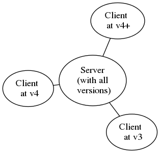
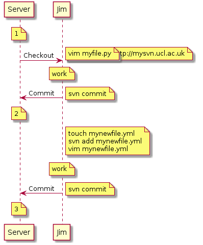
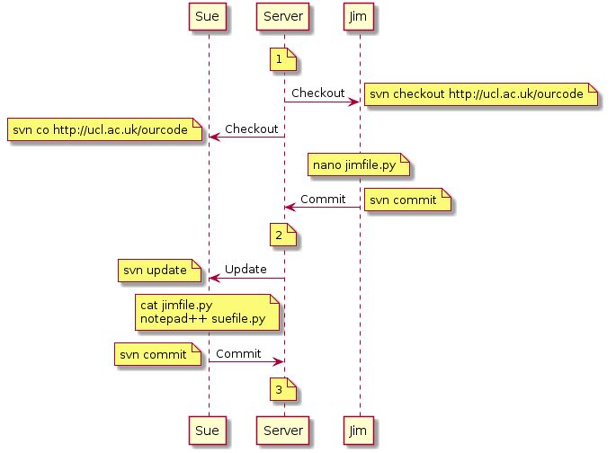
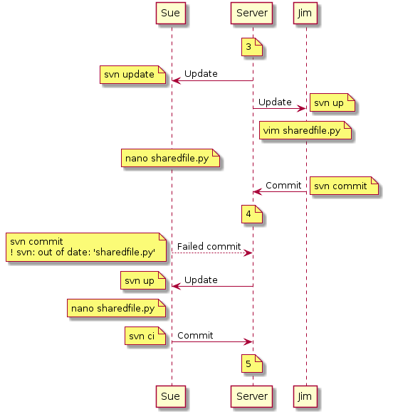
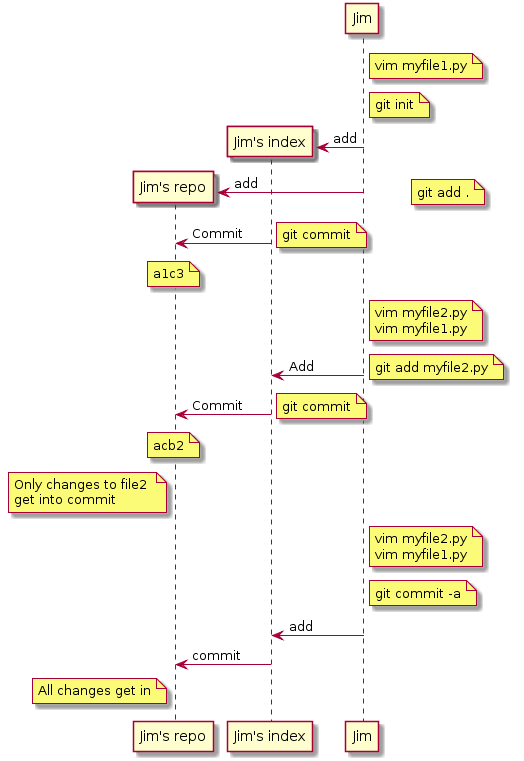
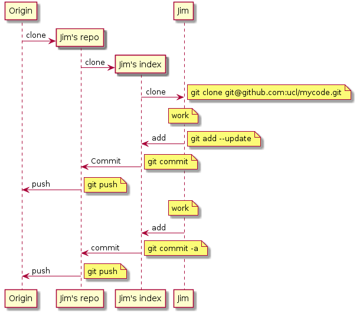
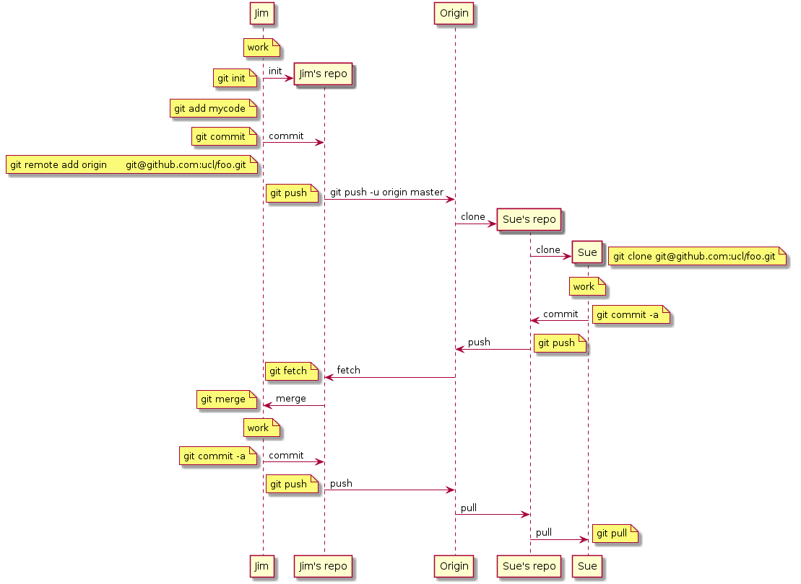
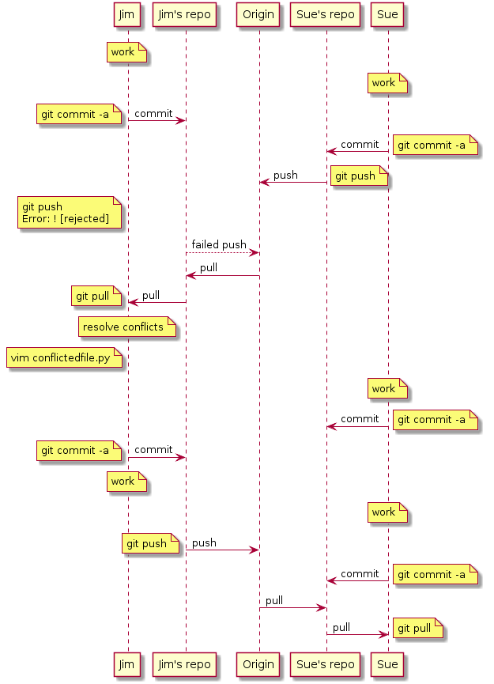

Practical Version Control and Issue Tracking
============================================

What Version Control is For
---------------------------

* Managing Code Inventory
    * "When did I introduce this bug"?
    * Undoing Mistakes
* Working with other programmers
    * "How can I merge my work with Jim's"

What is version control?
------------------------

Do some programming

`my_vcs commit`

Program some more

Realise mistake

`my_vcs rollback`

Mistake is undone

What is version control?
--------------------------

Sue                | James
------------------ |--------------------
`my_vcs commit`    |...
 ...               | `my_vcs checkout`
 ...               | do some programming
 ...               | `my_vcs commit`
`my_vcs update`    |more programming
Do some programming|...
...                |`my_vcs commit`
`my_vcs commit`    |...
Oh Noes! Error!    |...

Resolving conflicts
---------------------

`my_vcs commit`    |...
Oh Noes! Error!    |...
`my_vcs update`    |...
`my_vcs merge`     |...
`my_vcs commit`    |...
 ...               |`my_vcs commit`
 ...               |Error again...

Centralised Version Control
===========================

Centralised VCS concepts
------------------------

* There is one, linear history of changes on the server or **repository**
* Each revision has a unique, sequential identifier (1,2,3,4...)
* You have a **working copy**
* You **update** the working copy to match the state of the repository
* If someone else has changed the repository while you were working:
  * You update to get their changes
  * You have to **resolve conflicts**
  * Then you commit

Centralised VCS diagram
-----------------------


                    
Centralised VCS solo workflow
----------------------------------------


Centralised VCS team workflow
----------------------------------------


Centralised VCS conflicted workflow
----------------------------------------


Resolving conflicts
-------------------

On update, you get a prompt like:

``` Bash
svn update
> Conflict discovered in ’sharedfile.py'. 
> Select: (p) postpone, (e) edit, (mc) mine-conflict ...
```

If you choose `(e)` the conflicted file will look something like:

``` Diff
Whatever was in the file before the conflicted bit
<<<<<<< .mine
Sue’s content
======= 
Jim’s content
>>>>>>> .r4
Content after the conflicted bit
```

It is your duty to edit this to fix conflicts, then save.

Revisiting history
------------------

Update to a particular revision:
``` Bash
svn up -r 3
```

See the differences between your working area and a revision
``` Bash
svn diff #To most recent version
svn diff -r 3
```

See what you've changed:

``` Bash
svn status
```

Get rid of changes to a file:

```
svn revert myfile.py
```

Distributed Version Control
===========================

Distributed versus centralised
------------------------------

Centralised                      |Distributed
------------------               |--------------
Server has history               |Every user has full history
Your computer has one snapshot   |Many local branches
To access history, need internet |History always available
You commit to remote server      |Users synchronise histories
cvs, subversion(svn)             |git, mercurial (hg), bazaar (bzr)

Distributed VCS in principle
----------------------------


Distributed VCS in practice
----------------------------


Pragmatic Distributed VCS
-------------------------

Subversion                    | Git
------------------------------| ---------------
`svn checkout <URL>`          | `git clone <URL>`
`svn commit`				          |`git commit -a; git push`
`svn up`					            |`git pull`
`svn status`                  |`git status`
`svn diff`                    |`git diff`

Why Go Distributed?
------------------

* Easy to start a repository (no server needed)
* Easy to start a server
* Can work without internets
* Better merges
* Easy branching
* More widespread support

Why Not Go Distributed?
-----------------------

* More complex commands
* More confusing

Distributed VCS concepts
------------------------

* Each revision has a parent that it is based on
* These revisions form a graph
* The most recent revision in each copy is the HEAD
* Each revision has a unique hash code
  * In Sue's copy, revision 43 is ab3578d6
  * Jim thinks that is revision 38
* When you *pull* from a *remote* the histories might conflict
  * Histories are *merged* together

A revision graph
----------------


Distributed VCS concepts (2)
----------------------------

* You have a *working copy*
* You pick a subset of the changes in your working copy
  to add to the next commit
* Changes to be included in the next commit are kept in a
  **staging area** (a.k.a. **index**)
* When you commit you commit:
  * From the staging area
  * To the local repository
* You **push** to **remote** repositories to share or publish
* You **pull** (or fetch) to bring in changes from a remote

The Levels of Git
----------------


Using Git
=========

Distributed VCS Solo Workflow
-----------------------------



Distributed VCS With Publishing
-------------------------------



Distributed VCS in teams without conflicts
------------------------------------------



Distributed VCS in teams with conflicts
------------------------------------------



Working with multiple remotes
-----------------------------

``` Bash
git remote add sue ssh://sue.ucl.ac.uk/somerepo
   # Add a second remote
git remote
   # List available remotes
git push sue
   # Push to a specific remote
   # Default is origin
```

Branches
========

Working with branches
---------------------


Working with branches in git
----------------------------

``` Bash
git branch # Tell me what branches exist
```
```
   * master # Asterisk tells me which one
     experiment # I am currently on
```
``` Bash
git checkout -b somebranch # Make a new branch
git checkout master # Switch to an existing branch
```

Sharing branches
----------------

``` Bash
git push -u origin experiment # Share a recently
                              # made branch
git push origin experiment #Republish a branch
git branch -r #Discover remote branches
git checkout origin/some_branch #Get a branch
                                #from a remote
```

Merging branches
----------------

``` Bash
git checkout master # Switch to master branch
git merge experiment # Merge the branch in
git branch -d experiment # Delete branch locally
git push --delete experiment # Delete published branch
```

A good branch strategy
----------------------

* A `production` branch: code used for active work
* A `develop` branch: for general new code
* `feature` branches: for specific new ideas
* `release` branches: when you share code with others
  * Useful for isolated bug fixes

Tagging
-------

Easy to read labels for revisions
Produce real results *only* with tagged revisions

``` Bash
git tag -a v1.3
git push --tags
```

Branching and tagging in subversion
-----------------------------------

* Subversion doesn't have real branches and tags
* Instead, each is a separate whole copy
* But you can still merge between copies

Hosting Servers
===============

Hosting a server
----------------

* Any repository can be a remote for pulls
* Can pull/push over shared folders or ssh
* Pushing to someone's working copy is dangerous
* Use `git init --bare` to make a copy for pushing
* You don't need to create a "server"

Hosting a server in the cloud
-----------------------------

* Many online services
* Github, bitbucket, sourceforge...
* I recommend GitHub
