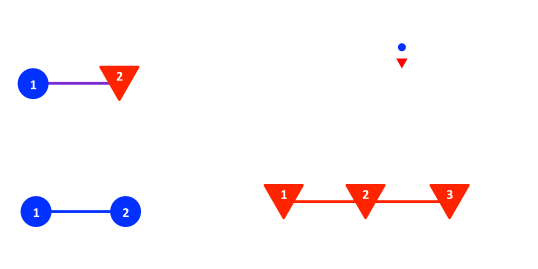

Introduction to Zacros
======================

Zacros:
-------

* Kinetic Monte Carlo (KMC) simulation of surface chemistry
* Graph theoretical formulation
    - Reaction given as graphs
    - identified as sub graphs of the lattice
* Possible Reactions get a time assigned based on:
    - kinetic rate constants (Propensities)
    - A random number

More details in [@stamatakis_graph-theoretical_2011] and [@nielsen_parallel_2013]

Surface energy
--------------

To calculate rates, the surface energy is needed:

* Surface energy is given as an expansion in cluster
* Number and size of patterns are important
    - For performance
    - Accuracy of simulation

Pseudo code
-----------

* Select reaction with the lowest time
* Remove adsorbates from lattice
* Remove clusters and reactions involving the reactants
* Add product adsorbates
* Find new energy clusters
* Find existing processes that need update
* Update rates of existing processes
* Add new processes.

Previous work: OpenMP
=====================

UCL research software development free project
----------------------------------------------

* Usually the bottleneck is "Update rates of existing processes"
* Many processes are affected
    - Especially for large cluster expansion
* Do loop of independent processes to update
* OpenMP parallization of this loop

See [@nielsen_parallel_2013]

Scaled performance of OpenMP
----------------------------

Computational time per event
----------------------------

Computational time / KMC time
---------------------------------

* But number of events per simulated second is not
* 12 figure expansion at 7056 lattice points (12 threads):
    - $> 10^4$ seconds per simulated second

Limitations
-----------

Decent speed up for large cluster expansions but:

* OpenMP only so limited to one node
* No real scope for additional parallelization here
* Simulations are still too slow for large lattices and clusters

MPI Parallelization over lattice

Archer embedded CEC
===================

Zacros Software Package Development:
------------------------------------

Pushing the Frontiers of Kinetic Monte Carlo Simulation in Catalysis

* 1 year Archer embedded CES project
* Started September 2014
* Distributed memory parallization of Zacros

Spatial parallelization
-----------------------

* Lattice is distributed over nodes in a 2D grid
* Well defined split of reactions
    - Reactions managed by node with 1. molecule of the elementary pattern
* Halo layers are needed for:
    - Other reactants
    - Products
    - Energetic clusters
* Changes to halos in neighbouring nodes modifies:
    - Viable reactions on other nodes
    - Rates of reactions on other nodes

Project plan:
-------------

To implement the algorithm proposed in [@lubachevsky_efficient_1988]

* Algorithm is developed for Ising spin model
* Each domain keeps track of a local time
* Global time is min(localTimes)
* Updates on a MPI domain is allowed if:
    - Local time is smaller than all neighbours

Algorithm
---------

* Perform reaction if time is smallest among neighbours
* Select a site and either:
    - Perform spin flip
    - Perform no reaction
* Advance local time by a random interval
* Repeat

Note that time advancement is independent of the reaction

Rates affect the probability of no flips happening

Consistency
-----------

Consistent with serial simulation because:

* Neighbour's state cannot have changed between it's local time and the local time of the domain with the lowest local time
* Otherwise a spin flip violating the initial condition should have happened

In Zacros
---------

* Future reactions have a wait time associated with them
* Wait time is random but determined by reaction rates
* Reaction with the lowest wait time is performed
* Reaction happen at $T_{local} + T_{wait}$ not at $T_{local}$
* Need to know state of neighbours at $T_{local} + T_{wait}$

In Zacros
---------

* Can't just change the condition to smallest among $T_{local} + T_{wait}$
    - The reactions that $T_{wait}$ on neighbours represent have not happened:
    - In fact they may never happen
    - Reactions on neighbours neighbour may change possible reaction on neighbouring domain.
* From a chemical perspective. Diffusion processes may propagate infinitely fast across the lattice

Alternative strategies
----------------------

An alternative proposed by Jefferson [@jefferson_virtual_1985] 

* Each node propagates its reactions without synchronization
* Stores a list of anti reactions to performed reactions
* When a reaction is performed messages are sent to relevant neighbours
* If conflicts arise neighbours will rollback sending anti messages to their neighbours
* The "slowest" node determine a virtual time horizon (Global time)
* Some similarity to Software transactional memory (STM)

Other strategies
----------------

* Martinez et. al. [@martinez_synchronous_2008] have implemented an approximate algorithm
    - Null events are inserted to allow synchronous execution
* Modify the Lubachevsky algorithm to ensure synchronization
    - Unclear how invasive and if feasible

Bibliography
============

Bibliography
------------

Publications