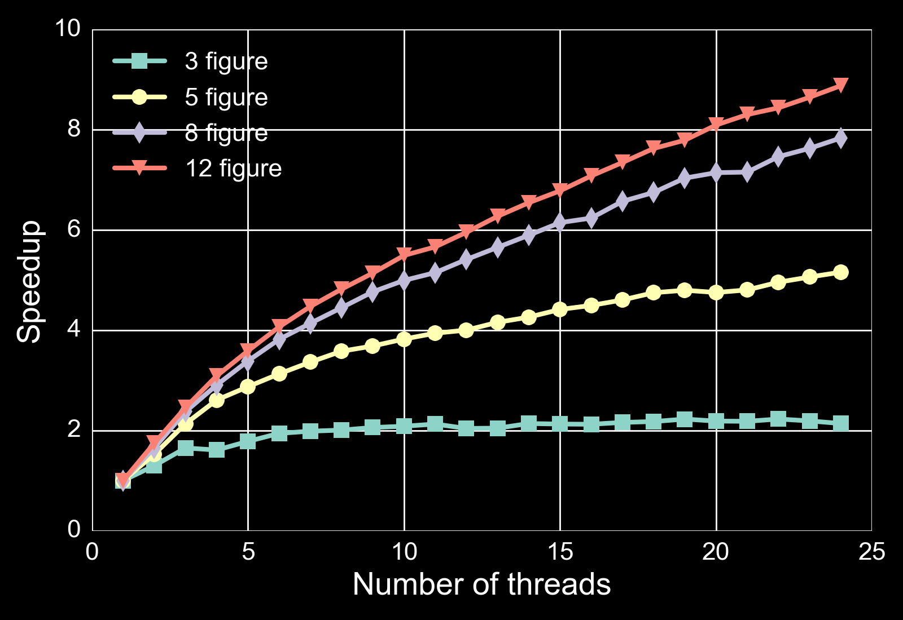
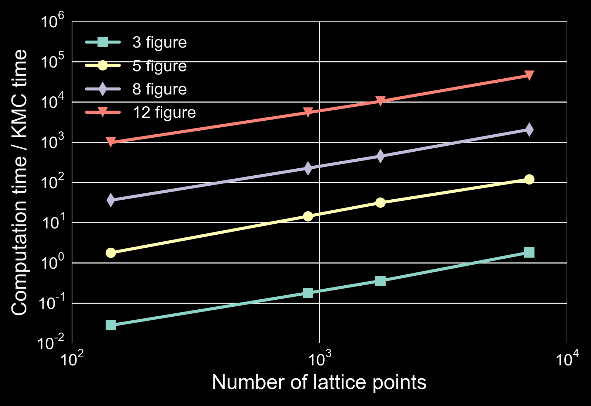

Introduction to Zacros
======================

Zacros:
-------

* Kinetic Monte Carlo (KMC) simulation of surface chemistry.
* Graph theoretical approach.
* Reactions selected based on propensities.
* Surface energy expressed in cluster expansions.
Pushing the Frontiers of Kinetic Monte Carlo Simulation in Catalysis

Pseudo code
-----------

* A reaction is selected based on:
    - Its propensities
    - A random number
* All adsorbates, clusters and reactions involving the reactants are removed
* Add product adsorbates to lattice
* Find new energy clusters
* Find all processes that need update
* Update rates of existing processes
* Add new processes

Previous work: OpenMP
=====================

UCL research software development free project
----------------------------------------------

* Usually the bottleneck is "Update rates of existing processes"
* Many processes are affected.
    - Especially for large cluster expansion.
* Do loop of independent processes to update.
* OpenMP parallization of this loop.

See [@nielsen_parallel_2013]

Scaled performance of OpenMP
----------------------------

* Describe simulation here

Computational time per event
----------------------------

* Time per KMC event is independent of lattice size

Computational time per KMC second
---------------------------------

* But number of events per simulated second is not.
* 12 figure expansion at 7056 lattice points (12 threads):
    - $> 10^4$ sec. per simulated sec.

Limitations
-----------

Decent speed up for large cluster expansions but:

* OpenMP only so limited to one node.
* No scope for additional parallelization here.
* Simulations are prohibiter slow for large lattices and clusters.
* MPI Parallelization over lattice.

Archer embedded CEC
===================

Zacros Software Package Development:
------------------------------------

Pushing the Frontiers of Kinetic Monte Carlo Simulation in Catalysis

* 1 year Archer embedded CES project
* Started September 2014
* Distributed memory parallization of Zacros

Spatial parallelization
-----------------------

* Lattice is distributed over nodes in a 2D grid.
* Reactions happen on the node that contains the 1. molecule in the pattern.
* Halo layers are needed for:
    - Other reactants
    - Products
    - Energetic clusters
* Changes to halos modifies:
    - Possible reactions on other nodes
    - Rates of reactions on other nodes

Existing works
--------------

Project plan:

To implement the algorithm proposed in [@lubachevsky_efficient_1988]

* Algorithm is developed for Ising spin model
* Each domain keeps track of a local time
* Global time is min(localTimes)
* Updates on a MPI domain are allowed if:
    - Local time is smaller than all neighbours

Algorithm
---------

* Perform reaction if time is smallest among neighbours
* Select a site and either:
    - Perform spin flip
    - Perform no reaction
* Advance local time by a random interval.
* Repeat

Note that time advancement is independent of the reaction.

Rates affect the probability of no flips happening.

Consistency
-----------

Consistent with serial simulation because:

* Neighbour's state cannot have changed between it's local time and the local time of the domain with the lowest local time.
* Otherwise a spin flip violating the initial condition should have happened.

In Zacros
---------

* Future possible reactions have a wait time associated with them.
* Wait time is random but determined by reaction rates.
* Reaction happen at $T_{local} + T_{wait}$ not at $T_{local}$
    - Need to know state of neighbours at $T_{local} + T_{wait}$

Zacros
------

* Can't just change the condition to smallest among $T_{local} + T_{wait}$
    - The reactions that $T_{wait}$ on neighbours represent have not happened:
    - In fact they may never happen.
    - Reactions on neighbours neighbour may change possible reaction on neighbouring domain.

Leftover
--------

[@martinez_synchronous_2008]
and
[@jefferson_virtual_1985]

Various published methods

Unit Testing
============

Testing
-------

tearte

Bibliography
============

Bibliography
------------

test